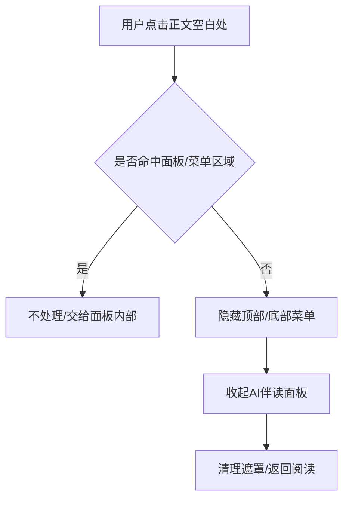

## Product Overview

阅读页内的「AI伴读」面板与其二级设置（AI设置/翻译设置/术语表）进行交互与UI重做：修复打开AI伴读面板时，点击正文无法隐藏顶部/底部菜单的问题；统一除AI问答外的伴读能力为“开关模式”，并在同一面板内完成二级页面推进与返回。

## Core Features

- 阅读页点击正文空白处：隐藏顶部/底部菜单，并同时收起AI伴读面板（行为对齐目录/阅读设置）
- AI伴读主面板：以卡片+开关行的形式统一展示持续型能力（翻译/朗读/图文），显示清晰的当前状态与说明文案
- AI问答面板：仅做面板UI优化与快捷语入口（如“总结”等），一次性能力从伴读主面板移除
- 二级设置内联导航：在当前面板内推进到 AI设置/翻译设置/术语表，提供顶部返回箭头与标题，关闭仅关闭当前层级
- 翻译设置精简：移除无效项（如“在阅读正文中显示”“翻译当前页”），并去掉多余开关/跳转按钮
- 术语表保留并优化：更易读的列表/编辑入口与状态提示，强调“生效中/未生效”等视觉反馈

## Tech Stack（遵循现有项目）

- 使用 [subagent:code-explorer] 先确认并复用仓库现有前端框架、状态管理与UI容器（如 BottomSheet/Drawer/Modal 组件）

## Tech Architecture

### State Pattern（阅读HUD统一状态机）

- 目标：保证“点击正文空白处”能同时驱动：顶部/底部菜单隐藏 + AI伴读面板收起
- 核心：将「HUD显示」与「面板栈」统一为单一可预测状态（单源状态），避免多个组件各自拦截点击



### Module Division（按现有目录落位）

- **ReaderHUDController**：管理顶部/底部菜单显隐、点击命中判定、对外暴露 hideAll()
- **CompanionPanel**：AI伴读主面板（开关项、入口卡片、状态展示）
- **CompanionSettingsNavigator**：面板内二级路由（push/pop），统一header返回/关闭逻辑
- **TranslationSettings / GlossarySettings / AISettings**：二级面板内容与状态渲染
- **CompanionPreferencesStore**：开关状态持久化与读取（复用现有存储方案）

## Implementation Details

### Core Directory Structure（示例；以仓库实际结构为准）

```
project-root/
├── src/
│   ├── features/
│   │   └── reader/
│   │       ├── ReaderPage.*                # 修改：点击正文空白处行为
│   │       ├── hud/ReaderHUDController.*   # 修改/新增：HUD统一控制
│   │       ├── companion/CompanionPanel.*  # 修改：主面板UI与开关模式
│   │       ├── companion/SettingsNav.*     # 新增：面板内二级导航
│   │       └── companion/settings/*.*
│   └── services/CompanionPreferencesStore.* # 修改/新增：状态持久化
```

### Key Code Structures（抽象接口）

- `HUDState = { topBottomVisible: boolean; companionOpen: boolean; activeBottomTab: 'toc'|'companion'|'reading' }`
- `PanelRoute = 'main' | 'ai-settings' | 'translation-settings' | 'glossary' | 'qa'`
- `CompanionToggles = { translate: boolean; tts: boolean; multimodal: boolean }`
- `hideAll(): void`：隐藏HUD并收起所有面板
- `pushRoute(route: PanelRoute): void / popRoute(): void`：二级面板推进/返回

## Design Style（阅读内嵌面板的高级感重做）

- 采用半透明玻璃拟态底部抽屉（Bottom Sheet）+ 清晰分组卡片；主面板信息密度适中，强调“状态可见、开关一致、返回明确”
- 动效：面板上滑/回退为 180–220ms 缓动；开关切换有轻微缩放与高亮过渡；状态变化以小型badge/次级文案即时反馈
- 交互：主面板→二级设置为“同面板内推进”，header左侧返回箭头，右侧关闭仅关闭当前面板层级

## Screens（≤6）

1) 阅读页（顶部/底部HUD）

- 顶部栏：书名/进度/更多；底部栏：目录 / AI伴读 / 阅读设置  
- 正文区：点击空白处触发“隐藏HUD+收起AI伴读”  
- AI伴读展开时：半透明遮罩轻度加深，保持可读

2) AI伴读主面板

- Header：AI伴读标题+关闭  
- 功能区：翻译/朗读/图文 三张功能卡（左图标，中间说明，右侧统一开关）  
- 状态展示：开启时显示“生效中”badge与简短说明；关闭显示“未开启”与引导文案  
- 入口区：AI问答入口（进入QA面板）

3) AI问答面板（仅UI+快捷语）

- Header：返回/关闭；内容区：对话列表  
- 快捷语条：如“总结”“解释”“提取要点”等chips，点击直接填充输入框

4) AI设置（二级）

- 以列表项+当前值（右侧小字）展示；无冗余跳转按钮  
- 重要项使用醒目分组标题与分割线

5) 翻译设置（二级）

- 移除无效项；保留关键项并显示当前状态/语言对  
- 关闭翻译回到主面板时，主面板卡片状态同步更新

6) 术语表（二级）

- 顶部搜索/新增；列表为术语-释义两行排版  
- 每条右侧“编辑/启用”轻量按钮；启用状态用高亮badge区分

## Agent Extensions

### SubAgent

- **code-explorer**
- Purpose: 扫描仓库阅读页/HUD/AI伴读相关实现、定位点击事件与面板容器、梳理现有状态管理与组件复用点
- Expected outcome: 产出可落地的改动文件清单、关键调用链（点击→HUD→面板）、以及可复用的面板/存储实现位置