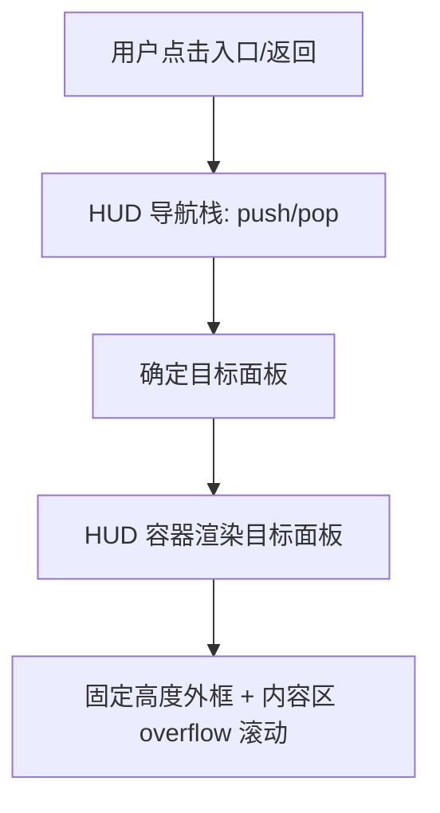
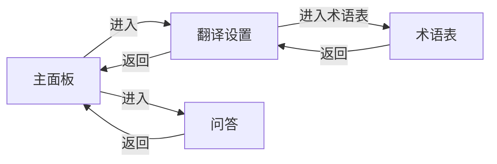

## Product Overview

调整 AI 伴读 HUD 的返回层级与容器高度策略：术语表返回到翻译设置，翻译设置返回主面板；HUD 外框固定高度，面板内容区内部滚动，消除面板切换时的高度跳变与卡顿，并保证“翻译设置→主面板”“问答→主面板”的过渡体验一致。

## Core Features

- **路由栈式返回**
- 术语表页点击返回：回到“翻译设置”
- 翻译设置页点击返回：回到“主面板”
- 问答页点击返回：回到“主面板”（与翻译设置一致的过渡手感）
- **HUD 固定高度 + 内部滚动**
- HUD 外框高度固定（视觉上保持稳定）
- 不同面板（主面板/翻译设置/问答/术语表）内容在内部滚动区域展示
- 面板切换时无明显高度跳变，减少布局重排导致的卡顿感

## Tech Stack

- 沿用仓库现有前端技术栈与状态管理/路由方式（通过代码检索确认 HUD 实现细节）
- 样式方案沿用现有（如 CSS/SCSS/Tailwind/CSS-in-JS 之一），仅补充 HUD 固定高度与滚动容器规则

## Tech Architecture

### Module Division（面向本次改动）

- **HUD 容器模块（外框与布局）**
- 责任：提供固定高度外框、标题/返回区、内容滚动区与面板切换承载
- 依赖：面板渲染模块、导航栈模块
- **HUD 导航栈模块（返回层级）**
- 责任：维护面板栈（push/pop/replace），统一返回行为
- 依赖：各面板入口（主面板/翻译设置/问答/术语表）
- **面板模块（主面板/翻译设置/问答/术语表）**
- 责任：仅负责自身内容渲染，不再驱动外框高度变化
- 依赖：HUD 容器提供的滚动区与导航栈提供的跳转接口

### Data Flow（关键流程）



### 返回链路（栈式）



## Implementation Details

### Core Directory Structure（示例，按实际仓库为准）

```
project-root/
├── src/
│   ├── components/
│   │   └── ai-hud/
│   │       ├── HudShell.*          # 可能：HUD 外框容器（固定高度/滚动区）
│   │       ├── useHudNavStack.*    # 新增或改造：导航栈逻辑
│   │       └── panels/
│   │           ├── MainPanel.*
│   │           ├── TranslateSettingsPanel.*
│   │           ├── GlossaryPanel.*
│   │           └── QAPanel.*
```

### Key Code Structures（接口示例）

- 面板标识与栈结构

```ts
type HudPanelKey = 'main' | 'translateSettings' | 'glossary' | 'qa';

type HudNavEntry =
  | { key: 'main' }
  | { key: 'translateSettings' }
  | { key: 'glossary' }
  | { key: 'qa' };

interface HudNavStackApi {
  current: HudNavEntry;
  push: (next: HudNavEntry) => void;
  pop: () => void;              // 返回（按栈）
  resetToMain: () => void;      // 兜底：直接回主面板
}
```

## Technical Implementation Plan

### 1) 路由栈式返回改造

1. 识别现有“面板切换/返回”实现点（按钮事件、状态字段、路由参数）
2. 引入或改造导航栈：进入术语表使用 push；返回使用 pop
3. 约束返回路径：Glossary 的 pop 必达 TranslateSettings；TranslateSettings pop 必达 Main
4. 为 QA 返回统一走 pop 或 resetToMain（取决于进入方式是否入栈）
5. 增加兜底：栈异常或空栈时 resetToMain

**Testing Strategy**

- 覆盖用例：主面板→翻译设置→术语表→返回→返回；主面板→问答→返回
- 验证：返回目标正确、无循环/死路、异常状态可回主面板

### 2) HUD 固定高度 + 内部滚动

1. 选定 HUD 外框高度策略（固定高度或固定最大高度+稳定基准），避免随内容变化
2. 将可滚动区域限定在内容容器（overflow: auto），外框/标题区不参与高度伸缩
3. 面板切换保持容器尺寸不变，仅替换内容节点
4. 优化过渡：避免切换瞬间的强制同步测量与反复 reflow（必要时延后测量/减少读写交错）

**Testing Strategy**

- 对比切换前后：HUD 外框高度不变；内容超出时可滚动
- 验证：翻译设置/问答/主面板之间切换无明显高度跳变与卡顿

## Agent Extensions

- **SubAgent: code-explorer**
- Purpose: 全仓检索 HUD 相关组件、面板切换逻辑、返回按钮绑定点与样式入口
- Expected outcome: 输出可改动的文件清单、当前导航/状态链路、以及需要改造的最小变更路径