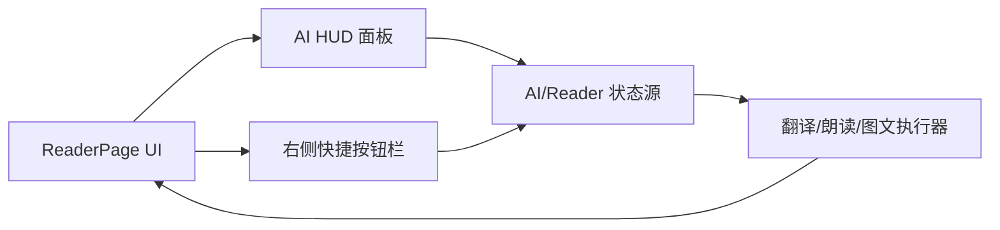
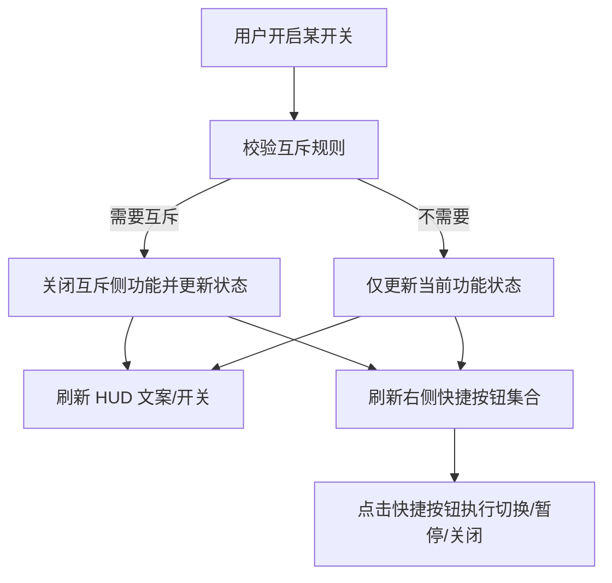

## Product Overview

阅读页内的「AI 伴读面板（HUD）」与「右侧快捷操作」视觉与交互重设：面板更精简、每行功能直达设置、已开启功能在阅读页右侧提供悬浮快捷按钮，并实现图文与翻译/朗读的自动互斥。

## Core Features

- **HUD 面板精简重排**
- 去除右上角关闭按钮；面板以轻量卡片样式常驻/按既有方式唤起。
- 三个功能（翻译 / 朗读 / 图文）以竖排开关列表展示：左侧图标+标题+简短状态文案，右侧为开关与「>」入口。
- **每行自带设置入口**
- 移除统一的“AI设置/总设置”入口（或从该区域退场）。
- 点击每行的「>」或整行（不含开关）进入对应功能的设置页/设置面板。
- **允许直接开启（取消“即将上线”提示）**
- 朗读/图文不再弹“即将上线”，开关可直接置为开启状态（后续逻辑补齐时保持 UI 不变）。
- **互斥规则：自动互斥（a）**
- 开启「图文」时自动关闭「翻译」与「朗读」。
- 开启「翻译」或「朗读」时自动关闭「图文」。
- 互斥发生时有清晰的视觉反馈（开关回落/状态文案更新，必要时轻提示）。
- **阅读页右侧快捷操作：竖排悬浮按钮（a）**
- 仅展示“已开启”的功能对应快捷按钮，贴右侧垂直排列、半透明悬浮、滚动时保持位置。
- 翻译快捷：一键切换「翻译/不翻译」与「关闭翻译」。
- 朗读快捷：一键「暂停/继续」与「关闭朗读」。
- 图文快捷：提供该功能的核心快捷操作（如显示/隐藏、下一张/刷新等，按现有能力对接）。

## Tech Stack

- Client: Flutter (Dart)
- State: 复用项目现有状态管理/事件分发方式（以现有 Reader / HUD 状态源为准）

## Architecture Design

### System Architecture



### Module Division

- **AI HUD Module (`ai_hud.dart`)**：功能开关列表、每行入口、互斥触发的交互承载
- **Reader Page Module (`reader_page.dart`)**：右侧悬浮快捷按钮容器、与阅读内容层叠布局
- **Translation Sheet Module (`translation_sheet.dart`)**：翻译设置面板打开方式与状态联动（复用既有）
- **AI Settings Entry (`ai_settings_sheet.dart`)**：统一入口的退场/改造为“按行进入对应设置”

### Data Flow（互斥与快捷操作）



## Implementation Details

### Modified / New Files (existing project)

```
lib/presentation/widgets/ai_hud.dart
lib/presentation/pages/reader/reader_page.dart
lib/presentation/pages/reader/widgets/translation_sheet.dart
lib/presentation/pages/reader/widgets/ai_settings_sheet.dart
```

### Key Code Structures (建议)

- `enum AiAssistFeature { translation, tts, illustration }`
- `class QuickActionItem { AiAssistFeature feature; QuickActionType type; bool enabled; }`
- `AiAssistState`：单一事实源（每个功能：enabled / running / mode），由 HUD 与快捷栏共同读取与派发更新

## Design Style（移动端阅读页）

- **整体**：深色/浅色自适应的玻璃拟态（半透明磨砂卡片），层级清晰但不遮挡阅读。
- **AI HUD 面板**：圆角卡片 + 轻阴影；三行功能列表等高，右侧开关紧凑；「>」为细线箭头图标，点击态有轻微缩放/涟漪。
- **右侧快捷按钮**：竖排胶囊按钮组悬浮在阅读内容右侧，半透明背景+描边；按钮带图标与短标签（可选），展开/按下有微动效；仅显示已开启功能。
- **互斥反馈**：发生互斥时，被关闭项开关回落并短暂高亮边框/提示条，避免用户困惑。

## Agent Extensions

### SubAgent

- **code-explorer**
- Purpose: 跨文件定位 HUD/Reader/设置面板的现有入口、状态源与互斥相关逻辑
- Expected outcome: 输出可复用的状态链路与需要修改的关键函数/组件清单，避免引入新范式