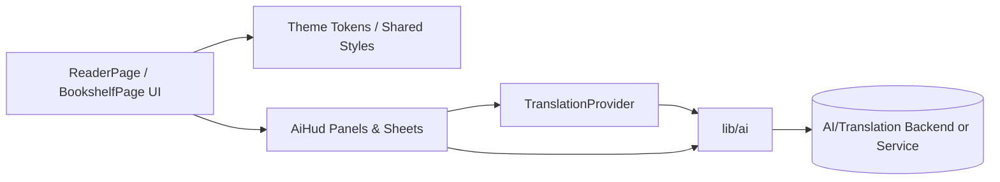

## Product Overview

在重做阅读页 AI 伴读（AiHud）交互与面板样式的同时，以阅读页为基准对全局进行“轻改”统一：采用轻磨砂/玻璃质感面板、统一圆角/描边/阴影与强调色；书架页向阅读页靠拢，避免视觉割裂。图文内容先做卡片化结构与占位图，不接真实生图。

## Core Features

- **全局视觉语言轻改统一**：统一圆角尺度、描边粗细、阴影高度、强调色与微渐变点缀；整体保持“Air/干净阅读风”，仅强化面板/卡片一致性。
- **阅读页面板方案 b 落地**：阅读页内所有浮层/抽屉/弹层（翻译、总结、AI 设置、AiHud 面板）统一为轻磨砂玻璃质感，背景有轻微模糊与透明度层次，滚动时有细腻高光变化。
- **书架页向阅读页对齐**：书籍卡片、分组/筛选面板、空态与占位图容器统一使用相同面板语言（圆角/描边/阴影/轻磨砂），强调色与交互反馈一致。
- **伴读交互规则确认落地**：翻译在 AiHud 内“单击开/关”；总结范围为“本章开头 → 当前阅读位置”，生成后覆盖刷新且不保留历史版本；AI 设置入口统一集中到一个位置。
- **卡片化图文结构**：阅读页内 AI 产出内容（如要点/解释/例句/图文卡片）使用统一卡片容器与占位图样式，确保信息密度与节奏一致。

## Tech Stack

- 沿用现有工程技术栈与 UI 基础设施（主题/样式方案、组件体系、路由与状态管理不做范式迁移）
- 既有模块优先复用：`TranslationProvider` / `TranslationSheet` / `ReaderPage` / `AiHud` 枚举 / `lib/ai`（当前仅翻译实现）

## Architecture Design

### System Architecture (对齐现有逻辑，新增仅为样式与 AI 能力扩展层)



### Module Division（仅拆到需要改动的层级）

- **Theme Tokens & Shared UI**：沉淀圆角/描边/阴影/玻璃面板参数；提供可复用的 Panel/Card 容器与交互态（hover/pressed/disabled）。
- **Reader Panels & AiHud**：统一阅读页内所有面板外观；落实翻译开关、总结范围与单入口设置。
- **Bookshelf UI Alignment**：书架卡片与面板容器对齐阅读页风格；占位图与空态一致。
- **AI Service Layer（扩展 lib/ai）**：在现有翻译基础上补齐总结等请求封装，统一错误态与加载态返回结构。

## Implementation Details

### Core Directory Structure（仅示例新增/修改项，实际以仓库现状为准）

```text
project-root/
├── src/
│   ├── components/
│   │   ├── ui/
│   │   │   └── GlassPanel.*        # 新增/改造：轻磨砂面板容器
│   │   └── ai/
│   │       ├── AiHud.*             # 修改：面板统一风格与交互规则
│   │       └── AiSettingsEntry.*   # 新增/修改：统一设置入口
│   ├── pages/
│   │   ├── ReaderPage.*            # 修改：阅读页面板统一
│   │   └── BookshelfPage.*         # 修改：书架页对齐阅读页视觉语言
│   ├── styles/
│   │   └── tokens.*                # 新增/修改：radius/border/shadow/accent/blur
│   └── lib/
│       └── ai/
│           ├── translate.*         # 既有：保持复用
│           └── summarize.*         # 新增：总结“章首→当前位置”
```

### Key Code Structures（关键数据结构与接口）

- **ThemeTokens**
- 圆角等级（xs/sm/md/lg）、描边（1px/0.5px）、阴影（多层柔和）、玻璃参数（blur/alpha/highlight）
- **AI 请求返回统一结构**
- `status: idle|loading|success|error`，包含可渲染的错误文案与重试动作
- **SummaryRequest**
- `chapterId/startOffset/currentOffset`（或等价定位），用于限定总结范围

### Technical Implementation Plan（按风险优先）

1. 先沉淀 tokens + 玻璃面板容器，确保阅读页与书架页可复用同一视觉语言
2. 再统一阅读页所有面板外观与动效（弹层/抽屉/卡片）
3. 最后补齐总结能力与设置入口聚合，联动加载/错误/空态表现

## Design Style

- 关键词：轻磨砂玻璃、干净留白、微渐变高光、统一圆角与细描边、低对比阴影、强调色点缀
- 基准页：阅读页；书架页向阅读页靠拢，避免两套“卡片语言”并存

## Page Planning（不超过 5 页/6 屏）

1) **书架页**：卡片化书籍列表 + 顶部筛选/搜索 + 统一玻璃面板
2) **阅读页**：沉浸式正文 + 轻磨砂 AiHud 浮层/抽屉
3) **翻译面板（Sheet/Drawer）**：与阅读页同质感玻璃面板，支持单击开关
4) **总结面板（Sheet/Drawer）**：展示“章首→当前位置”总结结果，覆盖刷新
5) **AI 设置入口（集中入口）**：统一入口触发的设置面板，样式与其余面板一致

## Block Design（每页自上而下，关键块）

### 书架页

- 顶部导航：标题/搜索入口/主要操作；透明底+轻描边，滚动时加轻阴影
- 筛选与分组面板：玻璃质感胶囊按钮，选中态用强调色与内发光
- 书籍卡片网格：统一圆角与细描边；封面占位图有微渐变与噪点质感
- 底部导航：与阅读页/全局一致的图标风格与选中强调色

### 阅读页（沉浸模式可无底部导航）

- 顶部阅读栏：返回/章节/设置入口；半透明玻璃条，滚动时提升不透明度
- 正文阅读区：背景干净，强调色仅用于标注与交互反馈
- AiHud 触发区：轻量悬浮按钮/手势触发；出现/消失有柔和缩放与淡入
- 面板容器（翻译/总结/设置）：统一玻璃面板、统一圆角与阴影层级

### 翻译/总结/设置面板（共用容器）

- 标题区：标题+关闭；细描边分隔
- 内容区：卡片化信息块；空态/加载态使用一致骨架与占位
- 操作区：主按钮强调色，次按钮弱化描边；错误态给可重试按钮
- 手势与动效：抽屉弹出采用轻弹性曲线，背景遮罩为低对比渐暗

## Agent Extensions

- **SubAgent: code-explorer**
- Purpose: 在仓库内跨目录检索现有主题/样式、Reader/Bookshelf/AiHud/Translation 相关实现与复用点
- Expected outcome: 输出可复用的组件/样式清单、改动文件列表与最小改造路径，避免引入割裂实现