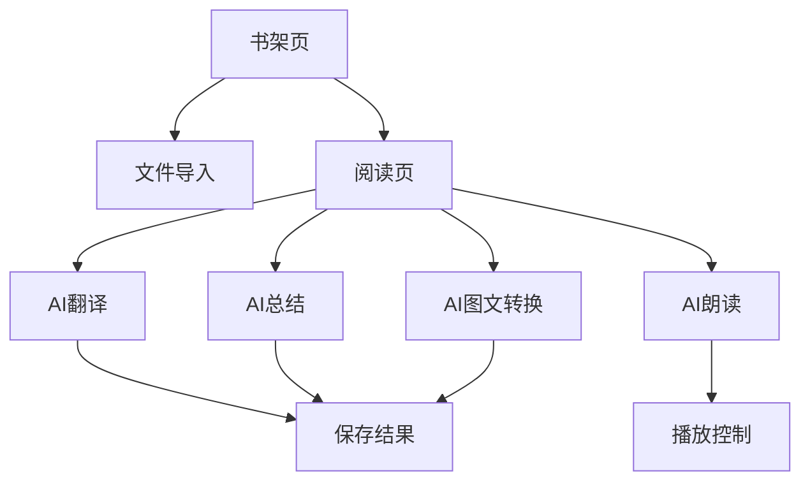

## 1. Product Overview
airRead是一款极简主义AI智能阅读应用，专注于提供轻盈流畅的阅读体验。通过AI技术赋能传统阅读，解决用户深度阅读、语言理解、内容提取等核心需求，为知识工作者和学生群体打造智能化的阅读伴侣。

## 2. Core Features

### 2.1 User Roles
| Role | Registration Method | Core Permissions |
|------|---------------------|------------------|
| 普通用户 | 无需注册，本地使用 | 基础阅读、文件导入、AI功能 |
| 高级用户 | 后续版本支持账号登录 | 云端同步、高级AI功能、社区功能 |

### 2.2 Feature Module
airRead的核心功能包含以下主要页面：
1. **书架页**：书籍展示、文件导入、分类管理
2. **阅读页**：文本阅读、AI功能、设置调节
3. **AI工具页**：翻译、总结、图文转换、朗读

### 2.3 Page Details
| Page Name | Module Name | Feature description |
|-----------|-------------|---------------------|
| 书架页 | 书籍列表 | 网格/列表视图切换，显示书籍封面、标题、阅读进度 |
| 书架页 | 文件导入 | 支持EPUB/TXT/PDF/Word格式文件导入，拖拽上传 |
| 书架页 | 分类管理 | 创建书架分类，拖拽排序，收藏夹功能 |
| 阅读页 | 文本显示 | 字体/字号/行距调节，日间/夜间/护眼模式 |
| 阅读页 | AI翻译 | 选中文字实时翻译，支持中英日韩等多语言 |
| 阅读页 | AI重点提取 | 智能识别关键句，动态高亮显示，交互式提取 |
| 阅读页 | AI章节总结 | 生成200/500字可调节摘要，一键复制分享 |
| 阅读页 | AI图文转换 | 文字场景转漫画插图，支持多种风格选择 |
| 阅读页 | AI朗读 | 高品质语音朗读，语速音调调节 |
| 阅读页 | 阅读设置 | 背景色、翻页动画、页面布局个性化设置 |

## 3. Core Process
用户主要操作流程：
1. **首次使用**：进入书架页 → 导入书籍 → 开始阅读
2. **阅读过程**：打开书籍 → 调节阅读设置 → 使用AI功能辅助理解 → 添加书签笔记
3. **AI功能使用**：选中文本 → 选择AI工具（翻译/总结/图文转换）→ 获取AI结果 → 保存或分享

## 4. User Interface Design
> 详细设计规范请参考 [UI/UX Guidelines](./airRead_UI_UX_Guidelines.md)

### 4.1 Design Philosophy: "Air & AI"
- **核心理念**：轻盈智慧 (Ethereal Intelligence)。界面如空气般无感，AI如魔法般随行。
- **视觉风格**：拟态玻璃 (Glassmorphism) + 极简主义。大量使用半透明模糊、流体渐变和柔和阴影。
- **色彩系统**：
  - **主色**：空气蓝 (#E1F5FE) - 营造轻盈基调
  - **强调色**：科技蓝 (#29B6F6) - 用于AI交互点缀
  - **流光色**：霓虹青 (#00E5FF) - AI处理时的动态光效
- **排版**：使用大留白和现代无衬线字体 (Inter/Noto Sans)，确保极致的阅读舒适度。

### 4.2 Dynamic Interactions (动效与交互)
- **零干扰交互**：
  - 默认隐藏所有非必要UI，仅保留文本。
  - **手势优先**：双指缩放改字号，边缘滑动翻页，长按唤起AI。
- **AI可视化反馈**：
  - **呼吸动效**：AI思考时，图标或选区呈现流体呼吸光效。
  - **流体高亮**：重点语句不仅仅是背景色块，而是如水墨晕染般的动态下划线或柔光。
- **页面转场**：
  - 书籍打开：封面悬浮放大进入阅读页 (Hero Animation)。
  - 菜单呼出：带物理回弹的非线性滑出效果。

### 4.3 Page Structure
| Page Name | Module Name | UI Elements & Interaction |
|-----------|-------------|---------------------------|
| 书架页 | 沉浸式书架 | 封面悬浮投影，背景随封面色模糊取色。下拉刷新带液态回弹效果。 |
| 阅读页 | 无界阅读 | 全屏文字，底部悬浮"胶囊"控制条(Dynamic Island风格)，上滑呼出AI控制台。 |
| 阅读页 | AI HUD | 透明毛玻璃蒙层，AI结果以卡片形式悬浮于文本之上，不遮挡上下文。 |
| 设置页 | 侧边抽屉 | 半透明背景，开关控件采用流体变形动画而非生硬切换。 |