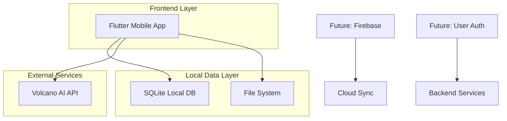

## 1. Architecture design



## 2. Technology Description
- **Frontend**: Flutter@3.16 + Dart@3.0
- **本地数据库**: SQLite@3.0 (通过sqflite插件)
- **AI服务**: 火山大模型API
- **文件处理**: EPUB@3.0 + PDF@2.0 + DOCX@0.4
- **状态管理**: Provider@6.0
- **UI框架**: Material Design 3组件
- **UI & Motion Libraries**:
  - `flutter_animate`: 声明式链式动画
  - `rive`: 复杂的AI交互动画
  - `glassmorphism`: 毛玻璃效果支持
  - `flutter_svg`: 矢量图标渲染
  - `google_fonts`: 字体管理

## 3. Route definitions
| Route | Purpose |
|-------|---------|
| / | 书架页，显示所有书籍 |
| /reader/:bookId | 阅读页，显示书籍内容 |
| /ai-tools | AI工具集合页面 |
| /settings | 应用设置页面 |
| /import | 文件导入页面 |

## 4. Core Components

### 4.1 文件处理模块
```dart
class BookImporter {
  // 支持格式：EPUB, TXT, PDF, DOCX
  Future<Book> importFile(String filePath);
  Future<List<Book>> scanDirectory(String dirPath);
}

class BookParser {
  // 文本提取和结构化
  Future<BookContent> parseEpub(String filePath);
  Future<BookContent> parsePdf(String filePath);
  Future<BookContent> parseDocx(String filePath);
}
```

### 4.2 AI功能模块
```dart
class AITranslationService {
  // 火山API翻译
  Future<String> translate(String text, String targetLang);
  Future<Map<String, String>> batchTranslate(List<String> texts);
}

class AISummaryService {
  // AI文本总结
  Future<String> summarize(String text, {int length = 200});
  Future<String> extractKeyPoints(String text);
}

class AIImageService {
  // 图文转换
  Future<String> textToImage(String text, {String style = 'comic'});
}

class AITTSservice {
  // AI语音朗读
  Future<void> speak(String text, {String voice, double speed});
  Future<void> stop();
}
```

### 4.3 数据模型定义
```dart
class Book {
  final String id;
  final String title;
  final String author;
  final String coverPath;
  final String filePath;
  final BookFormat format;
  final int totalPages;
  final DateTime importDate;
  ReadingProgress progress;
}

class BookContent {
  final List<Chapter> chapters;
  final Map<String, dynamic> metadata;
  final String rawText;
}

class Chapter {
  final String id;
  final String title;
  final String content;
  final int pageStart;
  final int pageEnd;
}

class ReadingProgress {
  final String bookId;
  final int currentPage;
  final double percentage;
  final DateTime lastRead;
  final List<Bookmark> bookmarks;
}

class Bookmark {
  final String id;
  final int page;
  final String note;
  final DateTime createdAt;
}
```

## 5. Local Database Schema

### 5.1 SQLite表结构
```sql
-- 书籍表
CREATE TABLE books (
  id TEXT PRIMARY KEY,
  title TEXT NOT NULL,
  author TEXT,
  cover_path TEXT,
  file_path TEXT NOT NULL,
  format TEXT NOT NULL,
  total_pages INTEGER DEFAULT 0,
  import_date INTEGER NOT NULL,
  current_page INTEGER DEFAULT 0,
  percentage REAL DEFAULT 0.0,
  last_read INTEGER
);

-- 书签表
CREATE TABLE bookmarks (
  id TEXT PRIMARY KEY,
  book_id TEXT NOT NULL,
  page INTEGER NOT NULL,
  note TEXT,
  created_at INTEGER NOT NULL,
  FOREIGN KEY (book_id) REFERENCES books(id) ON DELETE CASCADE
);

-- 阅读历史表
CREATE TABLE reading_history (
  id TEXT PRIMARY KEY,
  book_id TEXT NOT NULL,
  start_time INTEGER NOT NULL,
  end_time INTEGER,
  duration INTEGER,
  pages_read INTEGER,
  FOREIGN KEY (book_id) REFERENCES books(id) ON DELETE CASCADE
);

-- AI使用记录表
CREATE TABLE ai_usage (
  id TEXT PRIMARY KEY,
  book_id TEXT NOT NULL,
  feature_type TEXT NOT NULL, -- 'translate', 'summary', 'tts', 'image'
  input_text TEXT,
  output_result TEXT,
  usage_time INTEGER NOT NULL,
  FOREIGN KEY (book_id) REFERENCES books(id) ON DELETE CASCADE
);
```

## 6. Performance Optimization

### 6.1 文件加载优化
- **分页加载**: 大文件采用虚拟滚动，只渲染当前可视区域
- **预加载**: 预加载前后3页内容，保证翻页流畅性
- **缓存策略**: 解析后的内容缓存到SQLite，避免重复解析

### 6.2 AI调用优化
- **批量处理**: 支持文本批量翻译，减少API调用次数
- **本地缓存**: AI结果缓存24小时，相同内容不再重复调用
- **异步处理**: AI功能异步执行，不影响阅读流畅性

### 6.3 内存管理
- **图片懒加载**: 封面图片按需加载，内存占用控制在150MB以内
- **文本渲染优化**: 使用Flutter的RichText组件，避免大文本卡顿
- **定时清理**: 定期清理超过30天的AI缓存数据