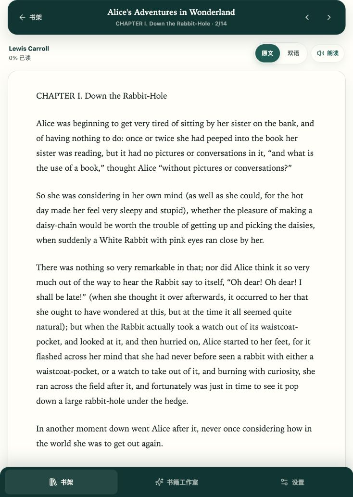
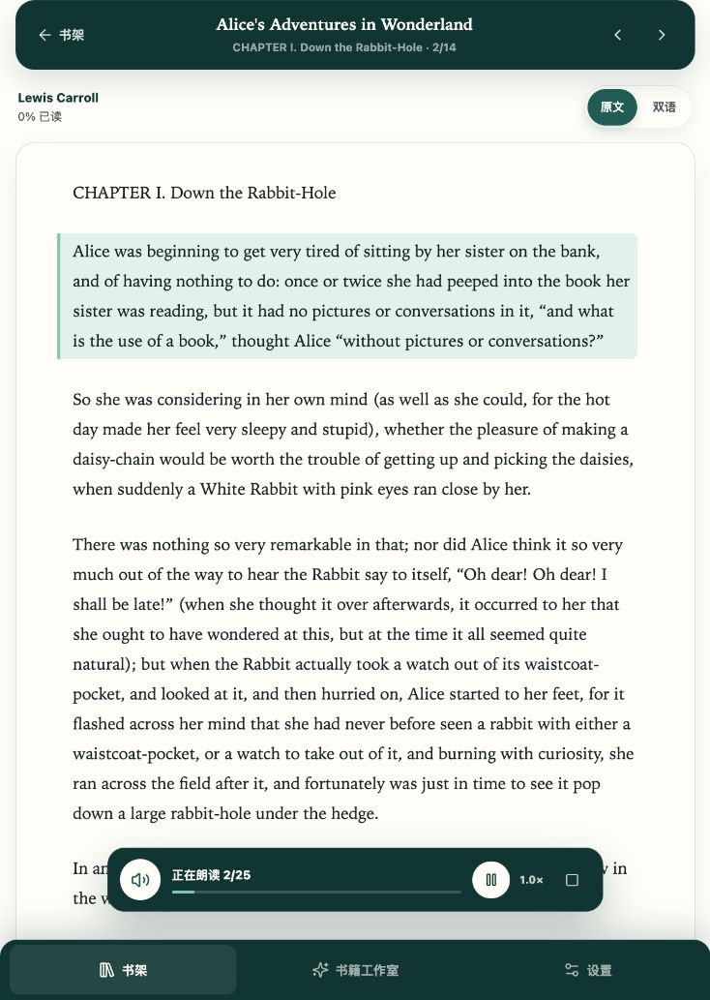
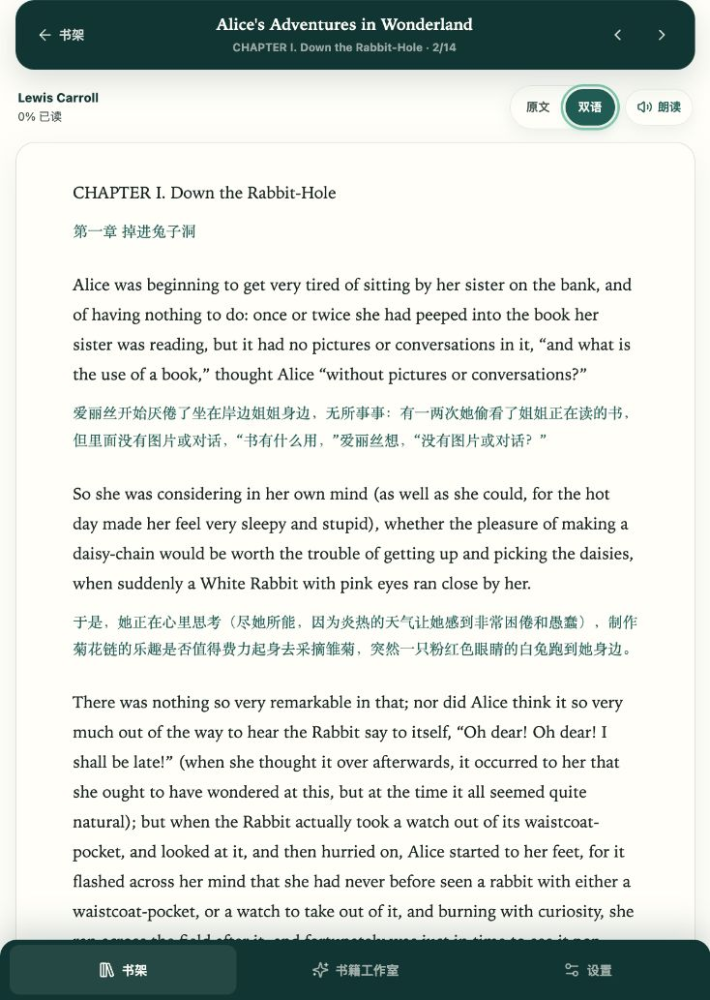

# AirRead 阅读页设计验收

验收日期：2026-07-24

验收视口：734 × 1033 CSS 像素（Codex In-app Browser）

## 参考方向

- 划词操作：`outputs/AirRead-reader-redesign-reference/selection-menu-source.png`
- 朗读播放器：`outputs/AirRead-reader-redesign-reference/tts-player-source.png`
- 本次实现保留“选中后操作菜单”和“底部固定迷你播放器”两条主线；第三组参考图不进入本次主流程。

## 验收步骤

### 1. 原文阅读态 — 健康

- 顶部章节栏、作者与阅读进度、原文/双语切换和朗读入口层级清晰。
- 阅读内容使用大字号衬线体，段落间距和底部导航在当前视口下没有遮挡正文。
- 截图状态：当前章节原文，朗读未启动。

### 2. 朗读播放态 — 健康

- 播放器固定在底部正文上方，显示当前段落进度、播放/暂停、速度和停止操作。
- 当前朗读段落以浅绿色背景和左侧强调线高亮，能够将听觉进度映射回阅读位置。
- 截图状态：章节朗读进行中，播放器显示 `2/25`。

### 3. 双语阅读态 — 健康

- 点击“双语”后使用同一阅读画布追加译文，原文与译文保持段落对应，顶部切换状态明确。
- 当前浏览器实测免费翻译成功生成 25 段译文；未配置付费服务也可以完成阅读验证。
- 截图状态：当前章节双语已生成，朗读播放器已停止。

### 4. 划词操作 — 代码与测试覆盖，浏览器截图受限

- `ReaderPage.test.tsx` 已验证：选中文本后默认只显示“翻译 / 朗读 / 复制”，点击“翻译”才发起请求，结果在浮层中展示并支持重试。
- 本次浏览器验收中，应用内浏览器的拖选事件没有产生可读的 `window.getSelection()`，因此无法生成可信的划词菜单截图；这属于验收工具限制，不代表产品交互失败。

## 结论

阅读主流程已通过视觉和交互验收：原文阅读、双语生成、底部朗读播放器均可用，划词操作由组件测试覆盖。后续若需要补齐浏览器级划词截图，建议用真实鼠标触控设备或 Playwright 原生文本选择能力复测。

## 证据限制

- 截图只能证明当前视口的视觉层级和可见状态，不能替代键盘焦点遍历、屏幕阅读器朗读、不同浏览器语音引擎和真实触控选择测试。
- 免费翻译结果依赖当前网络和 provider 状态；本次截图记录的是当前运行环境的成功结果。
